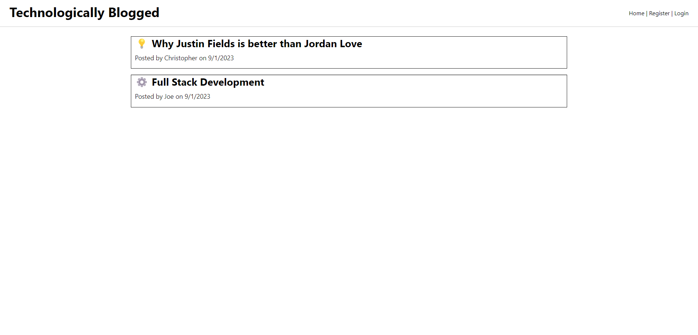

  # Technologically Blogged

  

  ## Description

  Hi! Im Christopher Banta! Let me tell you a little about my project.

  ### What was my motivation for creating this project?
  
  I really wanted to create a website where I could share and collaborate with my fellow developers!

  ### What problem does this solve?

  This allows me to easily create and discuss topics with my fellow developers

  ## Table of Contents

  - [Installation](#installation)
  - [Usage](#usage)
  - [License](#license)
  - [Contributing](#contributing)
  - [Tests](#tests)
  - [Questions](#questions)

  ## Installation

  N/A

  ## Usage

  Login or register to start posting to the website!

  
  [Link to deplyed application!](https://technologically-blogged-e9ac5a3cb1ea.herokuapp.com/)
  
  ## License

This project is covered under the MIT License license.

  ## Contributing

  N/A

  ## Tests

  N/A

  ## Questions

  For any questions or further inquiries feel free to contact me at either of the following:
  
  Github: [BantaChristopher](https://github.com/BantaChristopher)

  Email: <chris.banta@rocketmail.com>

  